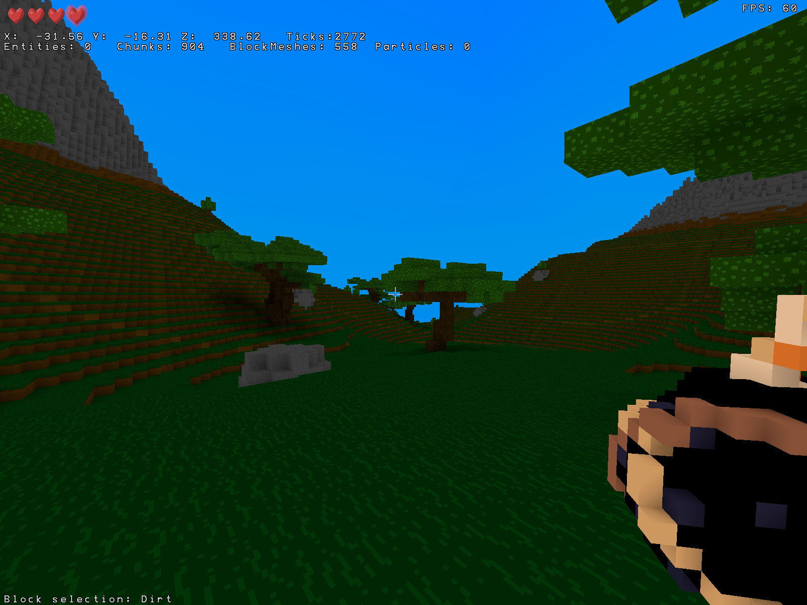
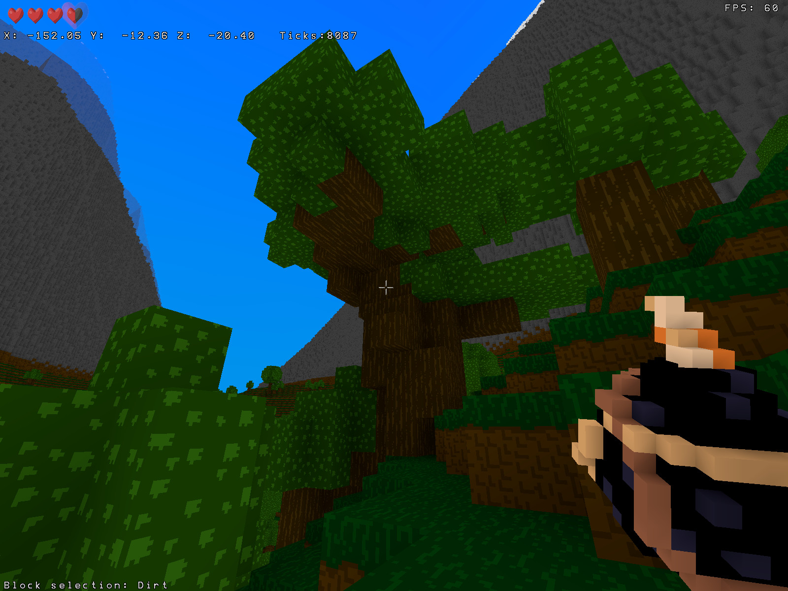
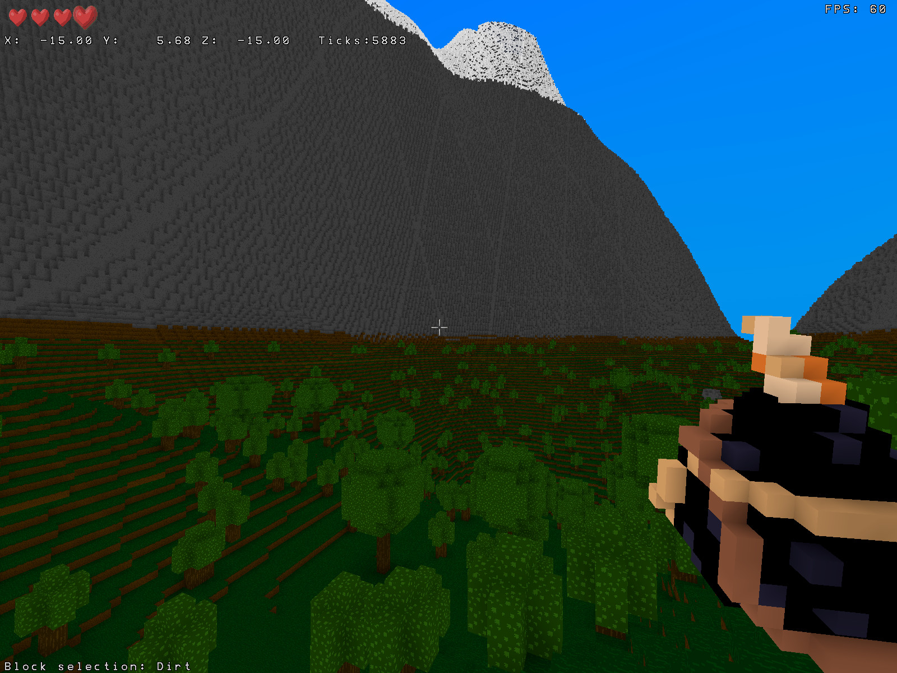
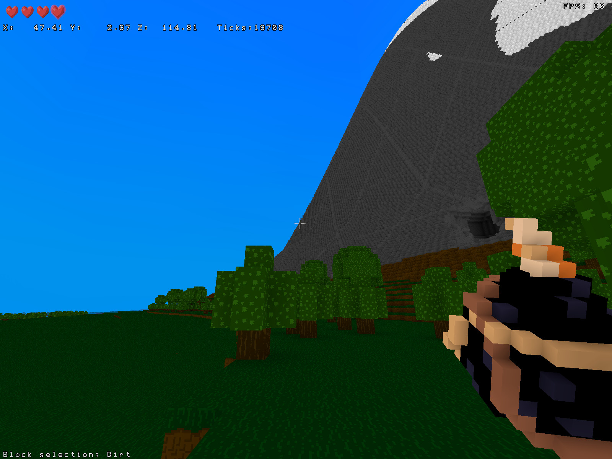
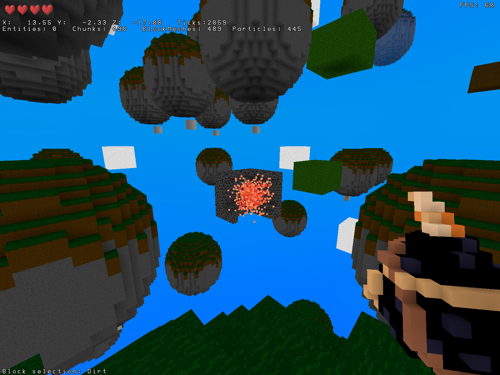
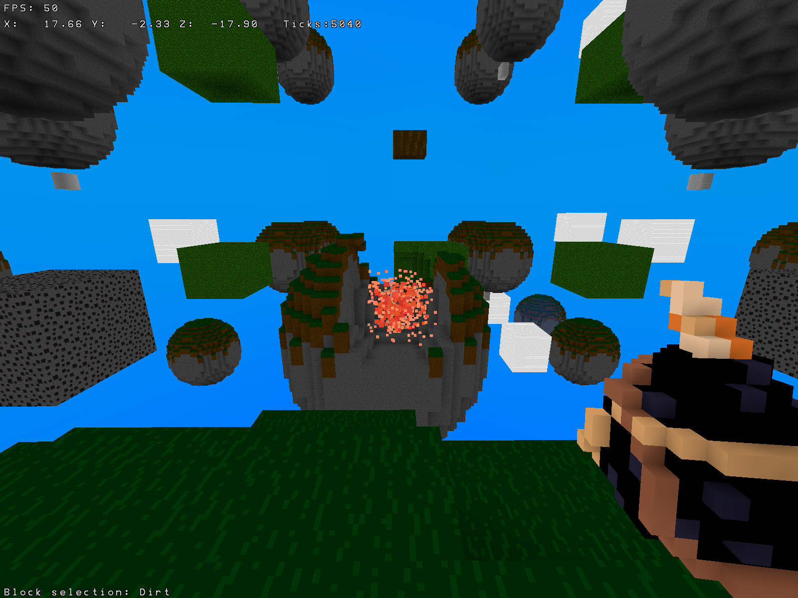
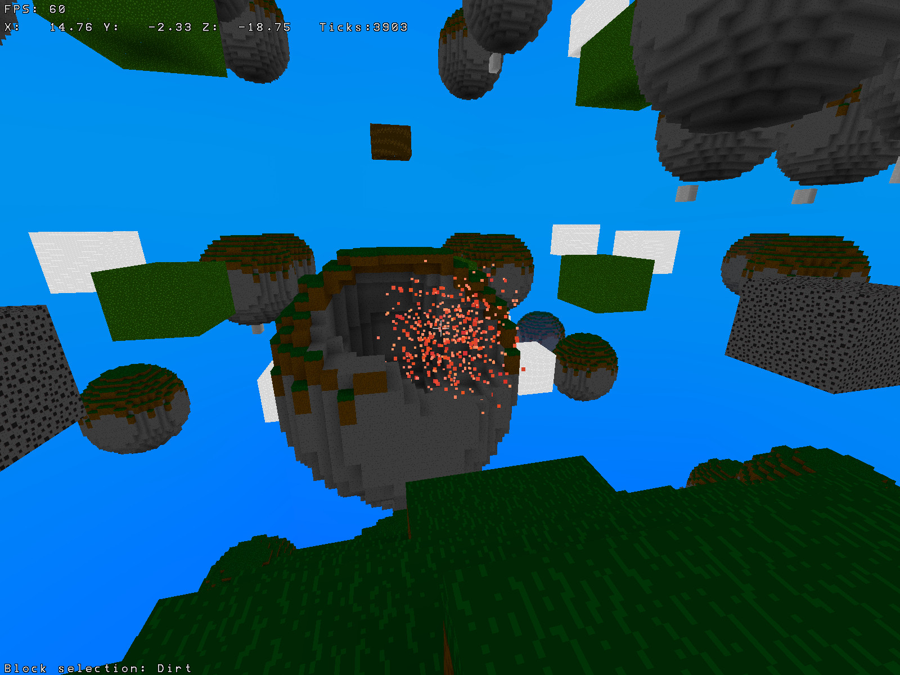
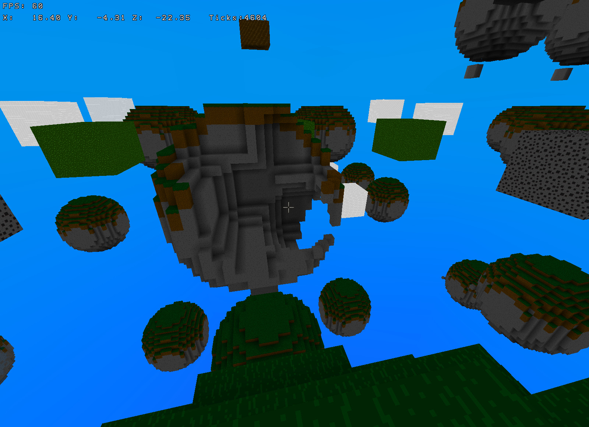
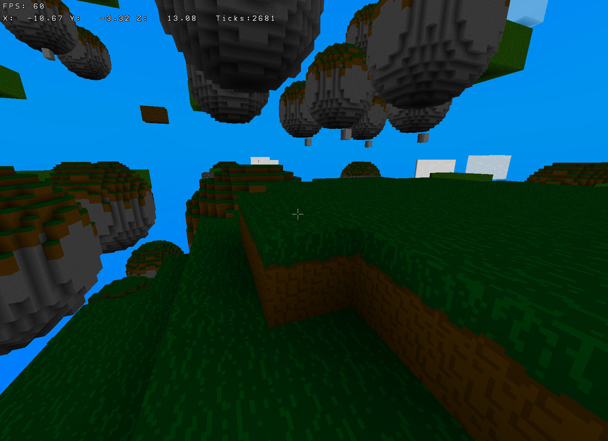

# WolkenWelten Screenshots
Here you can see current (and old) screenshots of the Rust WolkenWelten rewrite.

### 2022-11-13 - Added some variety

Fixed a couple of graphical glitches, and apart from that added 2 new tree models.

### 2022-11-12 - Fancy trees

Added functionality so that .vox assets can be used during worldgen, tried it out
with a tree I modeled in goxel in a couple minutes, so far everything looks very
promising. Might look into adding distortiong filters to add a bit of variance.

### 2022-11-11 - (Better) Landscapes

Improved the landscape generator a bit, mainly less artifacts and nicer mountains.

### 2022-11-10 - Landscapes

Played around with the `noise` crate and made a (hopefully) slightly more appealing
world generator.

### 2022-11-06 - Healthbar

Got around to building a crude health system and UI to show the current player's health, next up:
fall damage.

### 2022-11-04 - Voxel meshes

And now we can import voxel meshes from .vox files that can be created with tools such as
goxel. Since we are using the same meshgen function that's doing the world we get ambient occlusion
as well.

### 2022-11-03 - Particles

Finally got around to adding a simple particle system so the exploding pears look less
off. The effect of course looks slightly nicer animated :)

### 2022-10-29 - Dynamic world

Now we automatically recalculate lightmaps/meshes as the underlying voxel
data changes. In order to test this out the pears now explode on contact, leaving
behind a nice crater.

### 2022-10-26 - Ambient occlusion

Figured out why ambient occlusion wasn't working before, now things look much
nicer.

### 2022-10-26 - Smooth lighting

Still very much a prototype, but we're getting there, the lightmap calculation is
still incorrect quite often since it doesn't look at neighboring chunks yet.

### 2022-10-25 - Flat shading

Got flat shading to work, although there currently are no lightmaps, so I'm using
a XOR test pattern for now.

### 2022-10-25 - Beginnings

The state of the rewrite 2 weeks in, quite content with the overall progress,
still looks quite bad, but a lot of optimizations are already included in the voxel
renderer.
