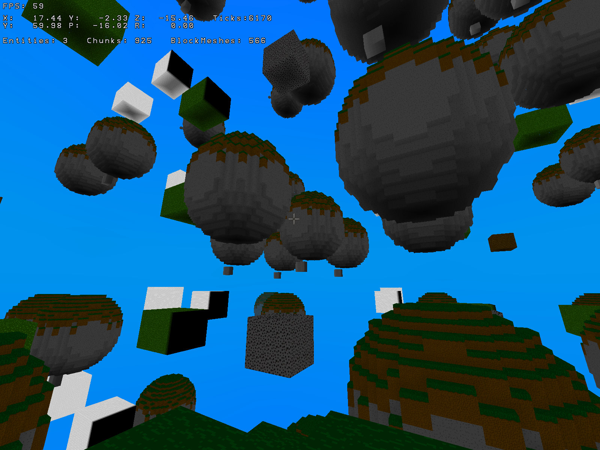
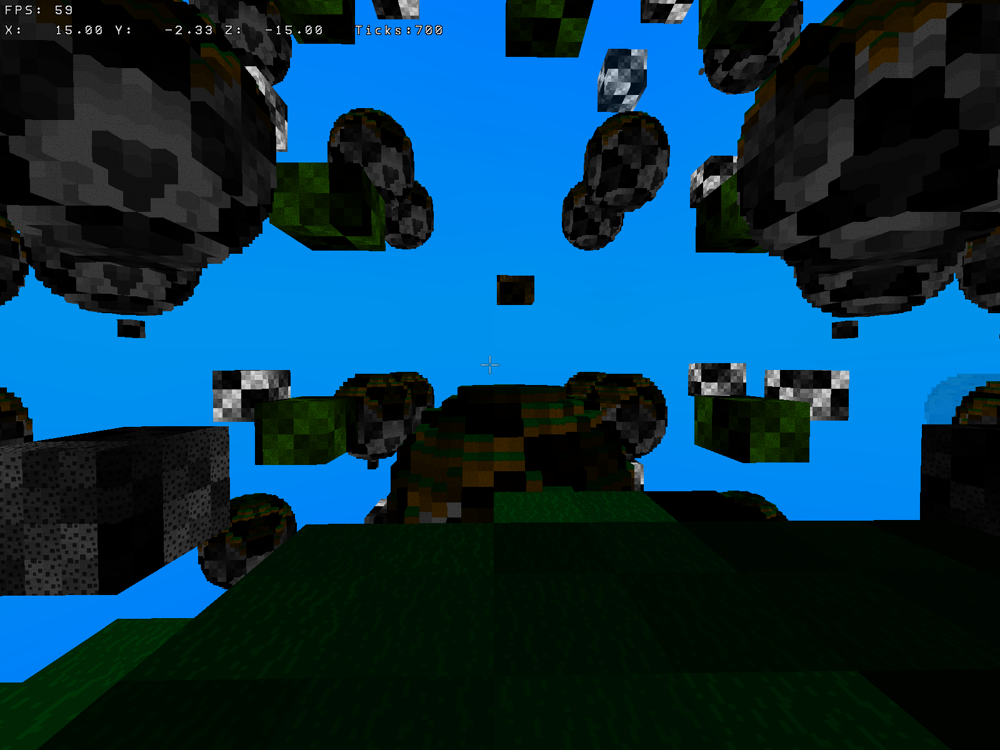
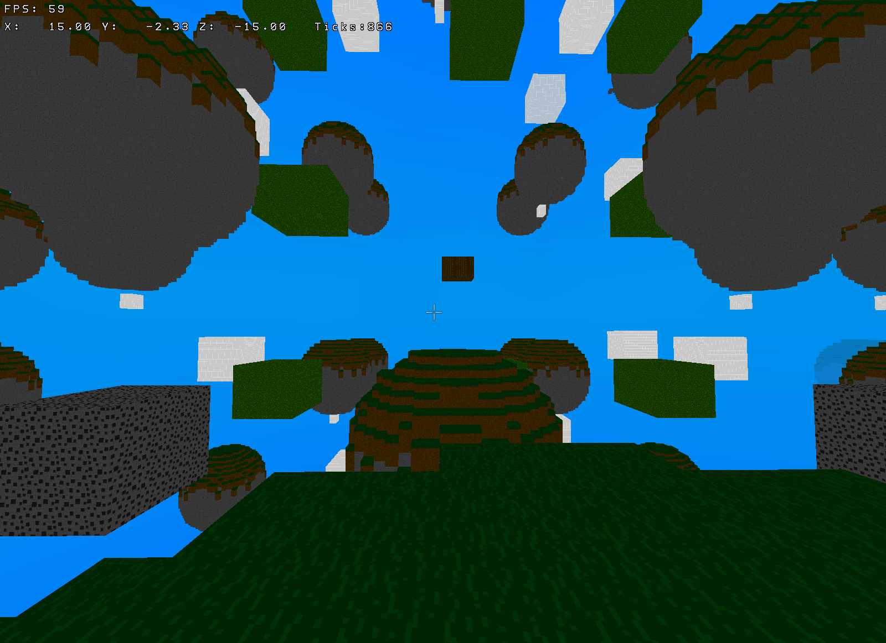

# WolkenWelten Screenshots
Here you can see current (and old) screenshots of the Rust WolkenWelten rewrite.

### 2022-10-26 - Smooth lighting

Still very much a prototype, but we're getting there, the lightmap calculation is
still incorrect quite often since it doesn't look at neighboring chunks yet.

### 2022-10-25 - Flat shading

Got flat shading to work, although there currently are no lightmaps, so I'm using
a XOR test pattern for now.

### 2022-10-25 - Beginnings

The state of the rewrite 2 weeks in, quite content with the overall progress,
still looks quite bad, but a lot of optimizations are already included in the voxel
renderer.
